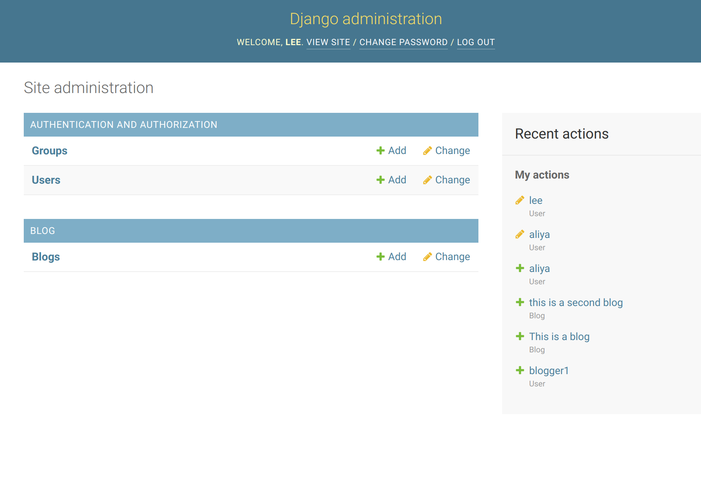
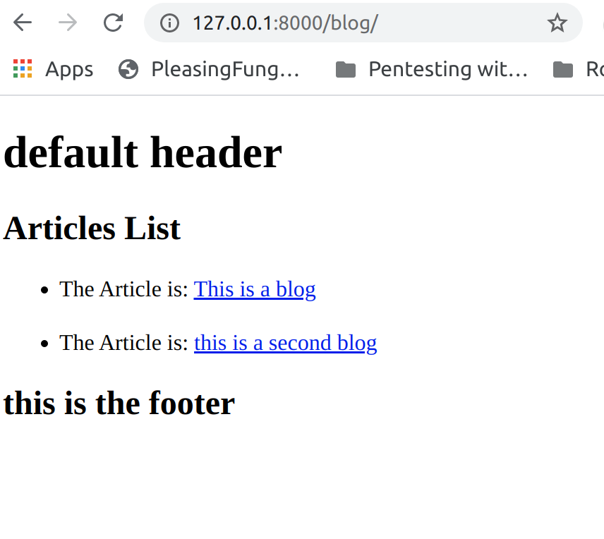

## Django Models

Lab27-Django models

*Author: Lee-Roy King*

----

## Description
This application is a simple Django server with a "blog" model that can be viewed at /blog

---

### Getting Started
Clone this repository to your local machine.

```
$ git clone git@github.com:leeroywking/django-models.git
```

### To run the program 
```
cd django-models
poetry install
poetry shell
django-admin runserver
```
User "aliya" with password "awesomesauce" added if you want to look at the admin interface for this application

---

### Visuals
/admin admin interface for django


/blog shows a list of available blogs


### Routes
/blog shows a list of available blogs
/admin admin interface for django
/blog_detail/<int>  shows blog with db ID of <int>

---

### Change Log
1.0 feature complete


------------------------------
For more information on Markdown: https://www.markdownguide.org/cheat-sheet
